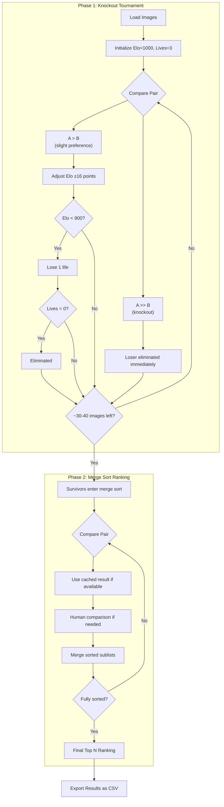

# Photobook Challenge

> [!WARNING]
>  This is a "vibe coding" experiment/project. Don't take seriously

A local web application that helps users efficiently rank images to select and order the top N images using a hybrid tournament approach that minimizes comparisons while ensuring high-quality results.

## Try It Now

**[Launch Image Ranker](https://jbgruber.github.io/photobook-challange/)**

The app runs entirely in your browser - your images never leave your device. Even when accessed from GitHub Pages, all processing happens locally on your machine.

> [!NOTE] 
>  While it may appear that you're "uploading" files, you're actually just granting the browser permission to access your local images. Due to browser security restrictions, web applications cannot directly browse your file system - they need explicit permission through the file picker dialog. Your images never leave your computer and all processing happens locally in your browser.

> **Privacy-conscious?** If you prefer not to trust a hosted version, you can:
> - [Download the app as a ZIP](https://codeload.github.com/JBGruber/photobook-challange/zip/refs/tags/v0.1) and open `index.html` locally
> - Clone the repo: `git clone https://github.com/JBGruber/photobook-challange.git`

## Features

### 🏆 Smart Tournament Algorithm
- **Phase 1: Knockout Tournament** - Multi-life system with Elo ratings eliminates weaker images
- **Phase 2: Precise Ranking** - Merge sort approach for final top N ranking
- Significantly fewer comparisons than traditional sorting methods

### 🖼️ User-Friendly Interface
- Side-by-side image comparison
- Keyboard shortcuts (1, 2, 3, 4) for rapid decisions
- Image zoom functionality
- Progress tracking with visual indicators
- Clean, distraction-free design

### 💾 Data Persistence
- **Auto-save**: Session state preserved in localStorage
- **CSV Export/Import**: Portable comparison history
- **Resume capability**: Pick up exactly where you left off
- **Results export**: Save final rankings as CSV

### ⚡ Performance Optimized
- Handles 100-2000+ images efficiently
- 100% local processing (files never leave your device)
- Smart image preprocessing and memory management
- Responsive design for all screen sizes

## How It Works

**Phase 1: Knockout** — Images start with Elo ratings (1000) and 3 lives. Compare pairs using "A > B" (slight preference, ±16 points) or "A >> B" (knockout, immediate elimination). Images lose lives when rating drops below 900; eliminated at 0 lives. Continues until ~30-40 candidates remain.

**Phase 2: Merge Sort** — Survivors are ranked using true merge sort with human comparisons. Previous comparisons are cached to avoid repeated questions. Guarantees completion in O(n log n) comparisons.

For 1000 images: ~2,000-3,000 comparisons vs ~10,000 for a full sort.

## License

This project is available under the MIT License. See the LICENSE file for details.
